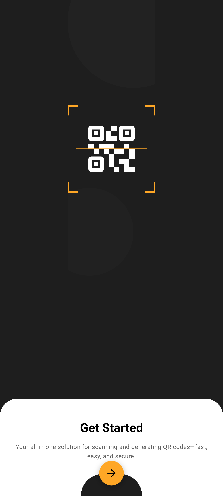
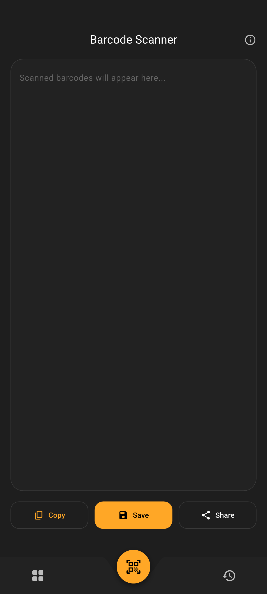
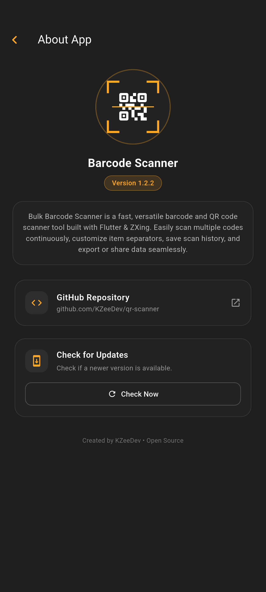

# Barcode Scanner

<p align="center">
  
  
  
  
  
</p>

A fast, versatile, open-source barcode and QR code scanner application built with **Flutter** and **ZXing**. Effortlessly scan multiple barcodes continuously, customize item separators, save scan history lists and share dataset results.

---

## 📱 Screenshots

<p align="center">
  
  &nbsp;&nbsp;
  
  &nbsp;&nbsp;
  
</p>

---

## ✨ Features

- ⚡ **Continuous Bulk Scanning**: Powered by `flutter_zxing` for high-performance scanning of 1D barcodes (*Code 39, Code 93, Code 128, EAN-13, UPC-A*) and 2D formats (*QR Code, Data Matrix*).
- 🛠️ **Custom Separators**: Format batch scan output automatically using configurable separators (Newlines, Commas, Semicolons, Pipes, or custom delimiters).
- 💾 **Scan History**: Save, label, manage, export, or clear saved scan batches using local persistent storage.
- 📤 **One-Tap Export & Sharing**: Copy raw or formatted barcode lists directly to the clipboard or share them across installed applications.
- 🔄 **In-App Auto Update Downloader**: Dynamically checks GitHub Releases for updates, streams APK downloads with a progress percentage bar, verifies cryptographic **SHA-1 checksums**, and prompts for installation.
- 🎨 **Modern Dark Design**: Premium dark theme featuring a custom curved bottom navigation bar and fluid micro-animations.

---

## 🏗️ Architecture

Built following **Clean Architecture** and **SOLID Principles**:

```text
lib/
├── core/
│   ├── constants/       # AppConstants, AppColors, AppStrings
│   ├── di.dart          # Service Locator / Dependency Injection
│   └── widgets/         # CurvedBottomNavigationBar & shared UI widgets
├── domain/
│   ├── models/          # SavedScan, SeparatorType, AppVersionInfo
│   └── repositories/    # ScanHistoryRepository, UpdateRepository interfaces
├── data/
│   ├── services/        # LocalStorageService, GitHubUpdateService, ApkDownloadService, AppInfoService
│   └── repositories/    # Implementation of domain repositories
└── ui/
    ├── core/            # App Theme definition
    └── features/
        ├── onboarding/  # Onboarding screen & graphic widgets
        ├── dashboard/   # DashboardScreen, ViewModels, HistoryBottomSheet, SeparatorDialog
        ├── scan/        # ScannerScreen, CustomOverlay, ResultScreen
        └── about/       # AboutScreen, AboutViewModel (Updates & GitHub info)
```

---

## 🚀 Getting Started

### Prerequisites

- [Flutter](https://docs.flutter.dev/install) (`>=3.44.4`)
- Android SDK (Target SDK 34)

### Installation & Running

1. **Clone the repository**:
   ```bash
   git clone https://github.com/kzeedev/qr-scanner.git
   cd qr-scanner
   ```

2. **Install dependencies**:
   ```bash
   flutter pub get
   ```

3. **Run the app**:
   ```bash
   flutter run
   ```

4. **Build Debug or Release APK**:
   ```bash
   # Debug APK
   flutter build apk --debug

   # Release APK
   flutter build apk --release
   ```

---

## 📄 License

Distributed under the MIT License. See `LICENSE` for details.

UI based on <a href="https://dribbble.com/shots/26114638-QR-Code-Scanner-App-UI-UX-Design">QR Code Scanner App – UI/UX Design</a>

---

<p align="center">
  Developed with ❤️ by <a href="https://github.com/KZeeDev">KZeeDev</a>
</p>
